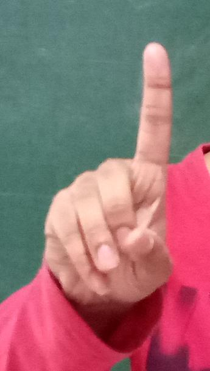
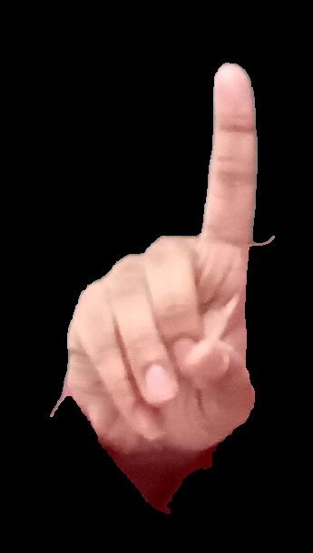

# Sign-Language-Recognition
Enabling the people with talking disabilities to communicate their thoughts without any obstruction by capturing the hand motion using the techniques  of Image Processing and processing them utilizing Machine Learning Analysis to compose sentences

## Motivation
One of the major drawback of our society is the barrier that is created between disabled or handicapped persons and the normal person. Communication is the only medium by which we can share our thoughts or convey the message but for a person with disability (deaf and dumb) faces difficulty in communication with normal person. Our aim is to design a system to help the person who is hearing impaired to communicate with the rest of the world using sign language or hand gesture recognition techniques by the process of converting the gestures to human readable texts.

## Workflow
1. A video stream of is to be sampled and processed in real time which contains the users showing various signs and the features of the hand gestures (like HOG) is to be extracted.
2. This features is to be considered as test data to previously trained dataset using advanced Machine Learning Models and thus a prediction of hand sign is made
3. Thus, the input video is stream is converted to human readable form sentences with meaning

## Tool Used
> OPEN-CV

## About the Dataset
The dataset consists of RGB images of 25 sign language gestures of the Indian Sign Language taken from 7 subjects. There are a total of 175 images. The following is the table of vocabulary considered for the project:

<table>
  <thead>
    <tr>
      <td> Sign Number </td>
      <td> Meaning </td>
      <td></td>    
      <td> Sign Number </td>
      <td> Meaning </td>
      <td></td>    
      <td> Sign Number </td>
      <td> Meaning </td>    
    </tr>
  </thead>
  <tbody>
    <tr>
      <td> 1 </td>
      <td> 1 </td>
      <td></td>    
      <td> 2 </td>
      <td> 2 </td>
      <td></td>    
      <td> 3 </td>
      <td> 3 </td>    
    </tr>  
    <tr>
      <td> 4 </td>
      <td> 4 </td>
      <td></td>    
      <td> 5 </td>
      <td> 5 </td>
      <td></td>    
      <td> 6 </td>
      <td> 6 </td>    
    </tr>
    <tr>
      <td> 7 </td>
      <td> 7 </td>
      <td></td>    
      <td> 8 </td>
      <td> 8 </td>
      <td></td>    
      <td> 9 </td>
      <td> 9 </td>    
    </tr>
    <tr>  
      <td> 11 </td>
      <td> A </td>
      <td></td>    
      <td> 12 </td>
      <td> Add </td>
      <td></td>    
      <td> 13 </td>
      <td> Appreciation </td>    
    </tr>  
    <tr>
      <td> 14 </td>
      <td> A-Signle Handed </td>
      <td></td>    
      <td> 15 </td>
      <td> Assistant </td>
      <td></td>    
      <td> 16 </td>
      <td> B </td>    
    </tr> 
    <tr>
      <td> 17 </td>
      <td> Bell </td>
      <td></td>    
      <td> 18 </td>
      <td> Between </td>
      <td></td>    
      <td> 20 </td>
      <td> Bite </td>    
    </tr>
    <tr>  
      <td> 22 </td>
      <td> Bottle </td>
      <td></td>    
      <td> 24 </td>
      <td> Boxing </td>
      <td></td>    
      <td> 25 </td>
      <td> B-Signle Handed </td>    
    </tr>
    <tr>    
      <td> 26 </td>
      <td> Bud </td>
      <td></td>    
      <td> 27 </td>
      <td> C </td>
      <td></td>    
      <td> 28 </td>
      <td> Conversation </td>    
    </tr>  
    <tr>
      <td> 29 </td>
      <td> Control </td>
    </tr>
  </tbody>
</table>
  
## Procedure
1. The Dataset is subjected to hand boundary detection effected by means of strict Skin detection algorithm along with opening, closing, to minimise noise level.
<table>
  <tr>
    <td>  </td>
    <td>  </td>
  </tr>
</table>

2. The above steps converts images in directory USER-userID-signID-trialNo to processed boundary detected hands in directed in USER-PROCESSED-userID-signID-trialNo.
3. The images in the directory USER-PROCESSED-i-j-k is learnt using ExtraTreeClassifier with 10 fold classification on HOG data description of images and an accuracy of **80%** is achieved. Cross fold classification score of 80 signifies a 80% +/- 5% of test data prediction accuracy.
4. Video is captured in real time, where frames are sampled and is subjected to skin detection, HOG feature extraction and prediction.
5. The predicted stream of data is then converted into text and written in a file

## Histogram of Oriented Gradient (HoG)
The histogram of oriented gradients (HOG) is a feature descriptor used in computer vision and image processing for the purpose of object detection. The technique counts occurrences of gradient orientation in localized portions of an image. The essential thought behind the histogram of oriented gradients descriptor is that local object appearance and shape within an image can be described by the distribution of intensity gradients or edge directions. The image is divided into small connected regions called cells, and for the pixels within each cell, a histogram of gradient directions is compiled. The descriptor is the concatenation of these histograms. For improved accuracy, the local histograms can be contrast-normalized by calculating a measure of the intensity across a larger region of the image, called a block, and then using this value to normalize all cells within the block. This normalization results in better invariance to changes in illumination and shadowing.

## Extra Tree Classifier
A Machine Learning Model that fits a number of randomized decision trees (a.k.a. extra-trees) on various sub-samples of the dataset and use averaging to improve the predictive accuracy and control over-fitting.
## Results
Below are few of the predicted results from the trained model
<table>  
  <tr>
    <td>  </td>
    <td>  </td>
  </tr>
</table>

## Future Work
1. Extending the above ideology to all symbols of Indian Sign Language
2. Improving upon the accuracy of the model, without sacrificing on speed of the result (A big challenge, indeed)
3. The described model, works fine for single handed gestures or hand gestures in which skin of both the hands overlap. A minor tweak in the part of hand detection, can make the model recognize hand gestures with disjoint hands as well.
